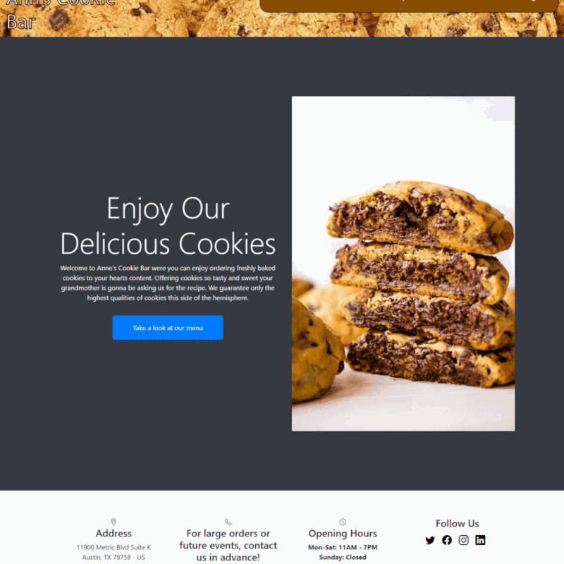

# Mock-Restuarant
  

  

  ## Table of Contents
  * [Description](#description)
  * [Requirements](#requirements)
  * [Usage](#usage)
  * [Contact-Info](#contact-info)
  * [Contributors](#contributors)
  * [Testing](#testing)
* [License](#license)

## Description
The purpose of this project was to create a functional and responsive framework for a restaurant website that would help developers get started with client criteria. The project contains many aspects that offline businesses would need to have to advertise an online presence, such as the ability for users to place online orders. For developers, this project is ideal for those who want to have the main functionality set and want to progress to future development of a fully-fledged site. The project utilizes Node.js and Express.js to create a RESTful API that uses GET and POST routes for retrieving data, Express and Sequelize through MySQL for database functionality, and Handlebars.js as a template engine where our project lives. The video linked in this README.md demonstrates how our project functions when running and includes instructions on potential changes that can be made to create your own functioning restaurant business.

## Requirements
    bcrypt: ^5.1.0
    bootstrap: ^5.3.0
    connect-session-sequelize: ^7.1.7
    dotenv: ^16.3.1
    express: ^4.18.2
    express-handlebars: ^5.3.4
    express-session: ^1.17.3
    moment: ^2.29.4
    mysql2: ^3.5.2
    nodemon: ^3.0.1
    passport: ^0.6.0
    passport-local: ^1.0.0
    path: ^0.12.7
    sequelize: ^6.32.1

Click to download latest version of Insomnia:  

## Usage
Node, Handlebars.js, JSON, JavaScript
## Contact-Info
* Username: rgadewar (https://github.com/rgadewar/)

## Contributors
* Username: jakelipscomb (https://github.com/jakelipscomb/)

* Username: RodolfoSL (https://github.com/RodolfoSL/)

* Username: khanadib21 (https://github.com/khanadib21/)

## Testing

To recreate this project, begin by cloning through:

    git clone https://github.com/rgadewar/mock-restaurant

To install required packages, run in terminal:

    npm i

Before running MySQL, make sure that a .env file is created with the following parameters filled out so that you can run the database:

    DB_HOST='localhost'
    DB_USER='root'
    DB_PASSWORD='*insert MySQL Password Here*'
    DB_NAME='mock_restaurant'
    SESSION_SECRET='your_session_secret'

Log into MySQL and run the command:

    source db/schema.sql;

Quit MySQL

To import client-side information, input in command line:

    node seeds/seedDatabase

Run application with

    npm start

Use Insomnia to run functionality tests.

## Repository

- [Project Repo](https://github.com/rgadewar/mock-restaurant/)

## Heroku App

- https://mock-restaurant-9eb3720005cf.herokuapp.com/

## License
    This Project is using the MIT license.

    Copyright (c) 2023 Rupa

    Permission is hereby granted, free of charge, to any person obtaining a copy of this software and associated documentation files (the "Software"), to deal in the Software without restriction, including without limitation the rights to use, copy, modify, merge, publish, distribute, sublicense, and/or sell copies of the Software, and to permit persons to whom the Software is furnished to do so, subject to the following conditions:

    The above copyright notice and this permission notice shall be included in all copies or substantial portions of the Software.

    THE SOFTWARE IS PROVIDED "AS IS", WITHOUT WARRANTY OF ANY KIND, EXPRESS OR IMPLIED, INCLUDING BUT NOT LIMITED TO THE WARRANTIES OF MERCHANTABILITY, FITNESS FOR A PARTICULAR PURPOSE AND NONINFRINGEMENT. IN NO EVENT SHALL THE AUTHORS OR COPYRIGHT HOLDERS BE LIABLE FOR ANY CLAIM, DAMAGES OR OTHER LIABILITY, WHETHER IN AN ACTION OF CONTRACT, TORT OR OTHERWISE, ARISING FROM, OUT OF OR IN CONNECTION WITH THE SOFTWARE OR THE USE OR OTHER DEALINGS IN THE SOFTWARE.
